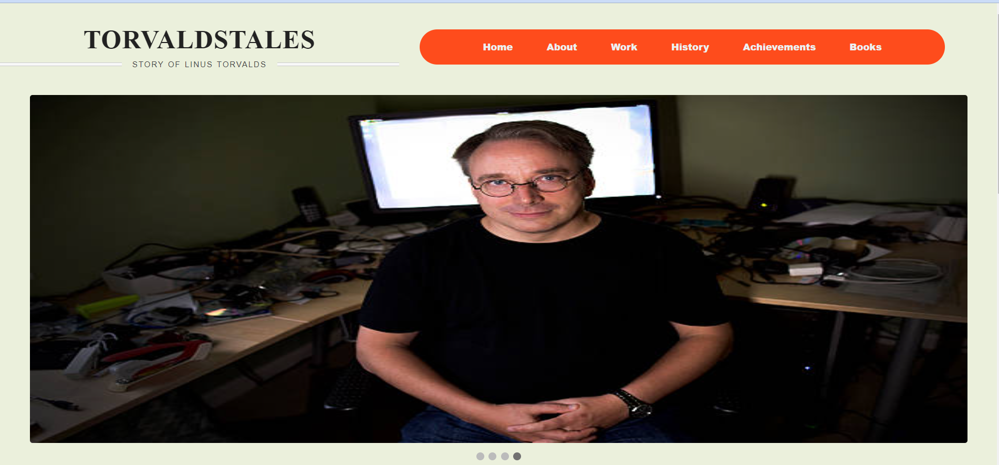
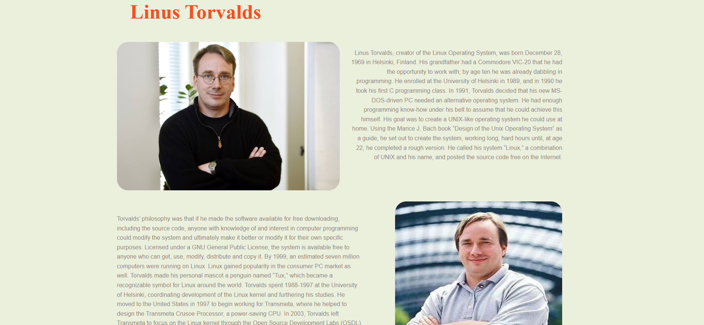
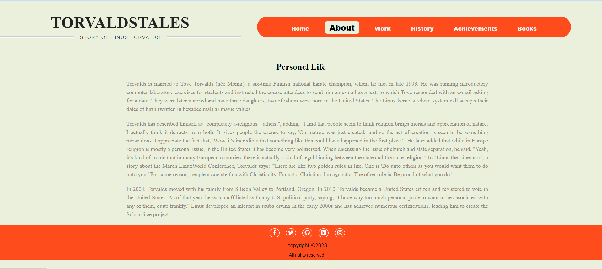
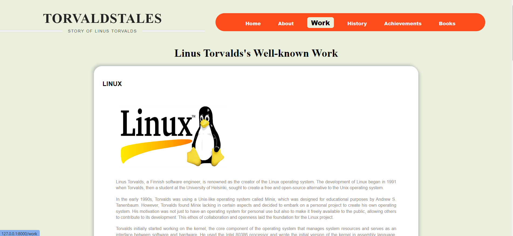
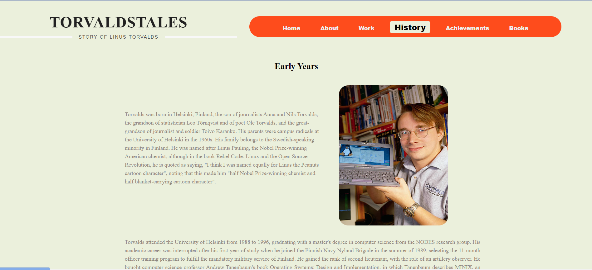
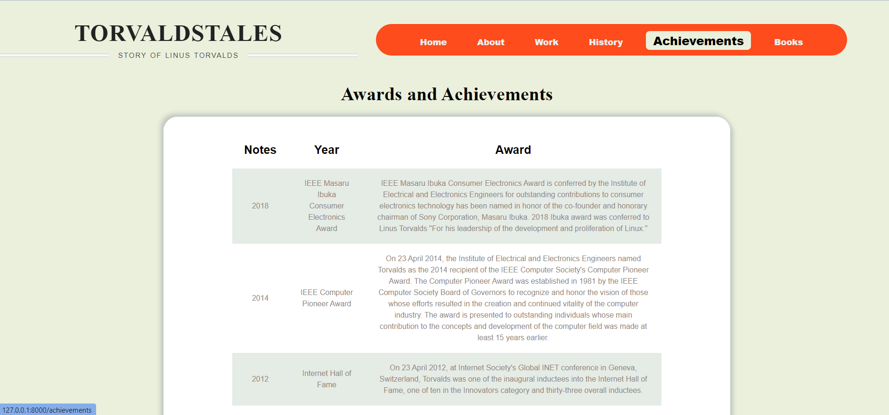
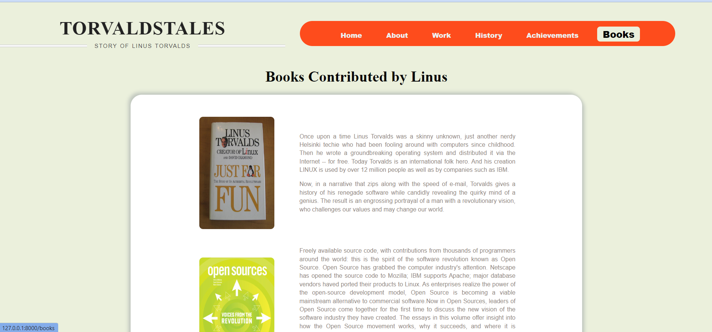

#TorvaldsTales 
  
##INTRODUCTION 
Welcome Everybody, this is my project "TorvaldsTales", a static website build using Laravel framework of PHP which display's information about Linus Torvalds, about the man who created Linux Operating System and Git. 
This website consist of 6 webpages 'Home', 'About', 'Work', 'History', 'Achievements' and 'Books' each displaying some information
  
##Pages Description 
###Page 1 - Home Page 
Home Page consists a Navigation bar, an Auto-Image Slider displaying images of Linus Torvalds and Little bit of Information about Linus followed by footer containing copyright information 
 
  

###Page 2 - About Page 
About Page Displays Information about Linus Torvalds 
  

###Page 3 - Work Page 
Linus has created 3 big projects till date, those are shown in Work Page 
  

###Page 4 - History Page 
It shows Life span of Linus, Including his Education and his Journey 
  

###Page 5 - Achievements Page 
Achievements Page involve details about Awards received by Linus Torvalds and list all his Achievements  
  

###Page 6 - Books Page 
This page shows information about the books written by Linus Torwalds 
  

